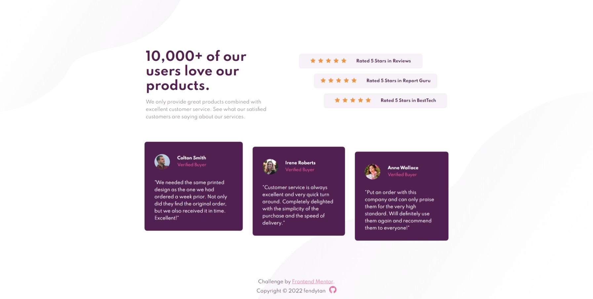

# Frontend Mentor - Social proof section solution

This is a solution to the [Social proof section challenge on Frontend Mentor](https://www.frontendmentor.io/challenges/social-proof-section-6e0qTv_bA). Frontend Mentor challenges help you improve your coding skills by building realistic projects.

## Table of contents

- [Overview](#overview)
  - [Screenshot](#screenshot)
  - [Links](#links)
- [Author](#author)

## Overview

### Screenshot

### Links

- Solution URL: [Github](https://github.com/fendytan/fm-social-proof-section/)
- Live Site URL: [Github Pages](https://fendytan.github.io/fm-social-proof-section/)

## Author

- Website - [Github](https://github.com/fendytan/)
- Frontend Mentor - [@fendytan](https://www.frontendmentor.io/profile/fendytan)
